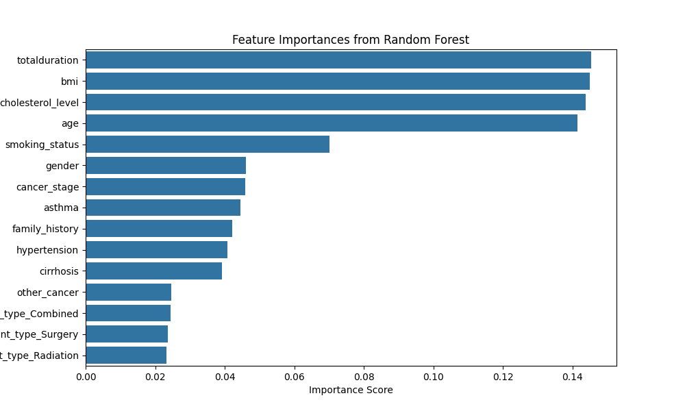
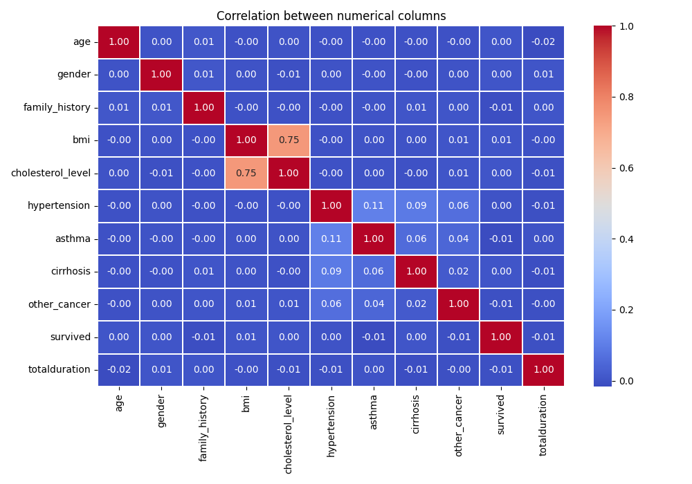
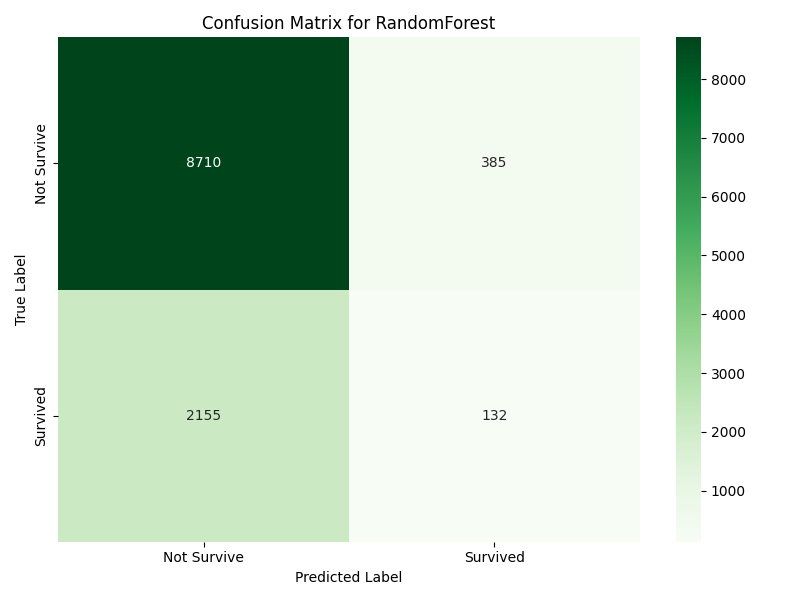

# Cancer Survival Prediction using Machine Learning

This project predicts **patient survival** using clinical and lifestyle data with a **Random Forest Classifier**. It includes exploratory data analysis, feature importance visualization, and model evaluation.

---

##  Project Overview

- **Objective:** Predict whether a patient survives or not  
- **Model Used:** Random Forest Classifier  
- **Problem Type:** Binary Classification  
- **Target Variable:** `survived`

---

##  Exploratory Data Analysis

### 🔹 Feature Importance

The plot below shows the importance of features as determined by the Random Forest model.

**Key Observations:**
- `totalduration`, `bmi`, `cholesterol_level`, and `age` are the most important features.
- Lifestyle and medical history features have moderate importance.
- Treatment-related features contribute less to the prediction.

---

### 🔹 Distribution of Numerical Features

The following figure shows the distributions of age, BMI, cholesterol level, and total duration.

.png)

**Insights:**
- Age follows a near-normal distribution.
- BMI and cholesterol levels are widely distributed.
- Total duration varies significantly across patients.

---

### 🔹 Correlation Analysis

The correlation heatmap below shows relationships between numerical features.

**Findings:**
- Most features have low correlation with each other.
- BMI and cholesterol level show strong positive correlation.
- The target variable does not show strong linear correlation with any feature.

---

##  Model Evaluation

### 🔹 Confusion Matrix

The confusion matrix below summarizes the model’s predictions.

**Interpretation:**
- The model correctly predicts most **Not Survive** cases.
- Survival cases are harder to predict due to class imbalance.
- Further improvement can be achieved using class balancing techniques.

---

## Tools and Technologies

- Python  
- Pandas, NumPy  
- Matplotlib, Seaborn  
- Scikit-learn  
- Jupyter Notebook  

---

## 📁 Project Files

- `cancer_classification.ipynb` – Main notebook  
- `important_features.png` – Feature importance plot  
- `distribution_of_age,bmi,cholesterol,totalduration(1).png` – Feature distributions  
- `correlation.png` – Correlation heatmap  
- `confusion_matrix.png` – Confusion matrix  

---

## 📌 Conclusion

This project demonstrates how machine learning can be applied to healthcare data to predict patient survival. The Random Forest model provides a strong baseline and useful insights into feature importance.

